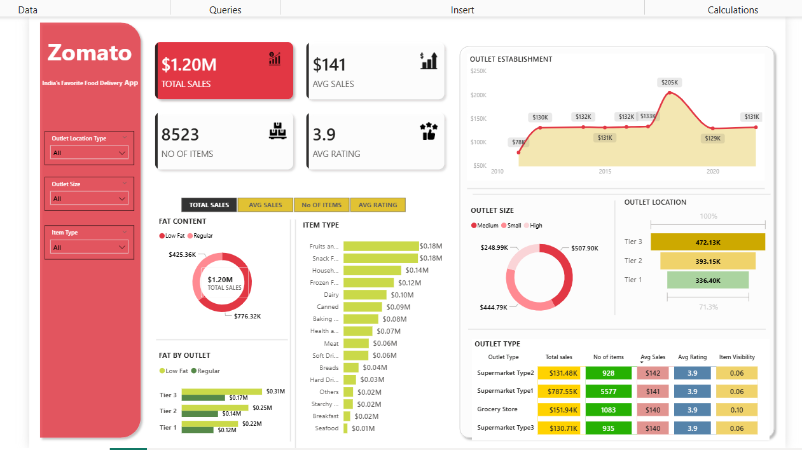

# Zomato Sales Analysis Dashboard

## Project Overview
This Power BI dashboard analyzes sales performance of Zomato outlets including item categories, outlet types, and location-based performance.

The goal of this project is to demonstrate data visualization, business intelligence, and analytical skills using Power BI.

## Key Features
- Interactive filters for Outlet Location Type, Outlet Size, and Item Type
- KPI cards showing Total Sales, Average Sales, Number of Items, and Average Rating
- Sales trend analysis based on outlet establishment year
- Sales distribution by Item Type
- Sales comparison across Outlet Size and Outlet Location
- Performance comparison of different Outlet Types

## Tools & Technologies
- Power BI
- Excel
- Data Visualization
- Business Intelligence

## Insights Generated
- Identified which outlet types generate the highest sales
- Compared sales performance across different outlet sizes
- Analyzed item category contribution to overall revenue
- Evaluated outlet location impact on sales performance

## Dataset
The dataset used in this project contains information about food outlet sales including:

- Item Type
- Outlet Size
- Outlet Location Type
- Outlet Type
- Sales
- Rating
- Item Visibility
- Outlet Establishment Year

The data was cleaned and transformed in Power BI before creating visualizations.

## How to Use

1. Download the `.pbix` file from this repository.
2. Open it using Microsoft Power BI Desktop.
3. Explore the interactive dashboard and filters.

## Dashboard Preview

  

---

## Author

**Ankith Kulkarni**  
B.Com (Honours)  
Aspiring Data Analyst / Data Scientist  

📧 Email: ankithsonu147@gmail.com  
🔗 LinkedIn: https://www.linkedin.com/in/ankith-kulkarni-64310422a  
💻 GitHub: https://github.com/Ankith-Kulkarni

This project demonstrates the ability to transform raw data into meaningful insights through interactive dashboards.
